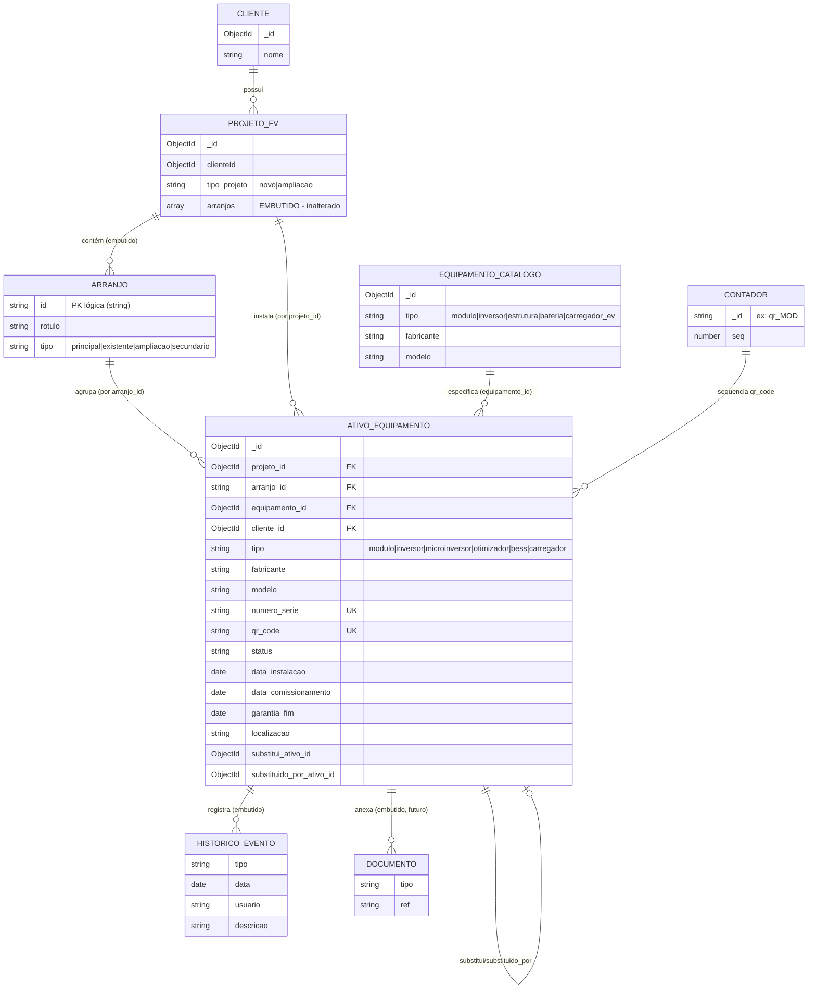
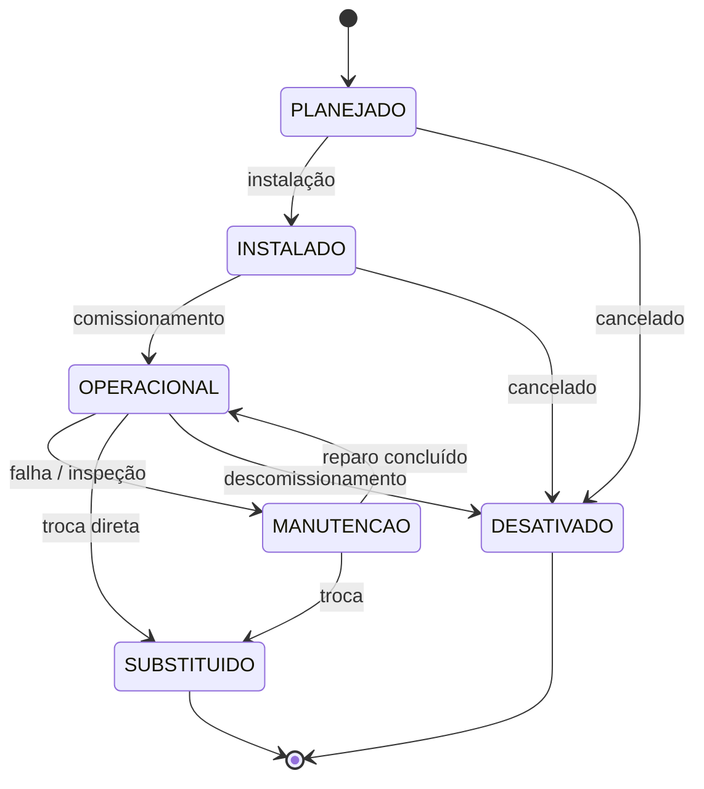

# P0-ASSET-MODEL-01 — Diagrama de Entidades

> Modelo de dados do Gêmeo Digital. Apenas desenho — nada implementado.

## 1. Diagrama Entidade-Relacionamento



## 2. Hierarquia de propriedade

```
Cliente
 └─ ProjetoFV (tipo_projeto: novo | ampliacao)
     ├─ arranjos[]  ──────────────  (EMBUTIDO em ProjetoFV — INALTERADO)
     │   ├─ id: "arr_A"  rotulo:"Arranjo A"  tipo:"principal"
     │   └─ id: "arr_B"  rotulo:"Ampliação"  tipo:"ampliacao"
     │
     └─ AtivoEquipamento[]  ───────  (COLEÇÃO PRÓPRIA — referência por projeto_id+arranjo_id)
         ├─ {arranjo_id:"arr_A", tipo:"inversor",      numero_serie:"SE33-998",  qr_code:"FORTE-INV-000010"}
         ├─ {arranjo_id:"arr_A", tipo:"modulo",        numero_serie:"HMF-0001",  qr_code:"FORTE-MOD-001001"}
         ├─ {arranjo_id:"arr_A", tipo:"modulo",        numero_serie:"HMF-0002",  qr_code:"FORTE-MOD-001002"}
         ├─ {arranjo_id:"arr_B", tipo:"microinversor", numero_serie:"TS-7781",   qr_code:"FORTE-MICRO-000007"}
         └─ {arranjo_id:"arr_B", tipo:"bess",          numero_serie:"BYD-5521",  qr_code:"FORTE-BESS-000003"}
```

## 3. Máquina de estados (ciclo de vida)



## 4. Cadeia de substituição (rastreabilidade da troca)

```
Inversor que falhou                      Inversor de reposição
┌───────────────────────────┐           ┌───────────────────────────┐
│ Ativo A                    │           │ Ativo B                    │
│ status: SUBSTITUIDO        │  ───────▶ │ status: OPERACIONAL        │
│ substituido_por_ativo_id: B│           │ substitui_ativo_id: A      │
│ historico: [..., troca]    │           │ historico: [instalacao,    │
│                            │           │             comissionamento]│
└───────────────────────────┘           └───────────────────────────┘
       (mantém histórico — nunca apagado)   (herda arranjo_id e localizacao de A)
```

## 5. Índices recomendados (para a implementação futura)

| Índice | Tipo | Propósito |
|---|---|---|
| `qr_code` | unique | resolução O(1) do QR; garante unicidade global |
| `numero_serie` | unique parcial (`partialFilterExpression: { numero_serie: {$type:"string"} }`) | unicidade do serial quando presente |
| `{ projeto_id, arranjo_id }` | composto | listar ativos de um arranjo |
| `projeto_id` | simples | listar todos os ativos da usina |
| `status` | simples | dashboards de O&M (quantos em manutenção, etc.) |
| `cliente_id` | simples | visão por cliente |
| `garantia_fim` | simples | alertas de garantia a vencer |

## 6. Coleção `Contador` (sequência de QR — atômica)

```jsonc
// _id por tipo → contador independente, $inc atômico (sem corrida)
{ "_id": "qr_MOD",   "seq": 1024 }
{ "_id": "qr_INV",   "seq": 87 }
{ "_id": "qr_MICRO", "seq": 41 }
{ "_id": "qr_BESS",  "seq": 6 }
```
Geração: `findOneAndUpdate({_id:"qr_MOD"}, {$inc:{seq:1}}, {upsert:true, returnDocument:'after'})`
→ `FORTE-MOD-` + `String(seq).padStart(6,'0')`.
